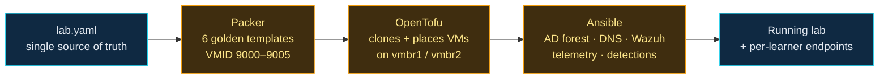

# Infrastructure as Code


This folder documents the effort to rebuild the MutaSpace SOC Lab as Infrastructure as Code.

The lab was originally built by hand through the Proxmox web interface, and documented step by
step as it was built. That was the right way to learn it. It is not a good way to rebuild it,
reset it between classes, or hand it to someone else.

This area covers the work of turning that hand-built lab into code:

- **Packer** builds golden VM templates from installer media
- **OpenTofu** provisions VMs on Proxmox from those templates
- **Ansible** configures the things that live inside the VMs



Every stage reads `lab.yaml`. Nothing downstream invents a VMID, an IP address or a
MAC address of its own — which is why changing one line in that file is enough to
add a learner to the classroom.

---

## Why This Matters

A classroom lab has requirements a personal lab does not.

It has to be resettable, because learners break things and that is the point. It has to be
reproducible, because a lab that only exists on one machine cannot be taught from. And it has to
be reviewable, because the infrastructure itself is teaching material.

Infrastructure as Code makes the lab's design readable. A learner can look at a file and see
which VM sits on which network, instead of clicking through a hypervisor UI and inferring it.

---

## ⚠️ This code is on a branch, not `main`

The Infrastructure as Code is deliberately kept off `main` for now. A plain clone gives you
documentation only. Before anything here works:

```
git checkout feat/infrastructure-as-code
```

[getting-started.md](getting-started.md) covers this as Step 0.

---

## Documents

| Document | Purpose |
|---|---|
| [getting-started.md](getting-started.md) | **The walkthrough.** Fresh checkout to running lab — open the repo in Claude Code and say "help me set up the lab" |
| [prerequisites.md](prerequisites.md) | Every tool, version and manually-acquired ISO needed before any of this runs |
| [session-handoff.md](session-handoff.md) | Current state, what is verified, what is not, and the next steps |
| [decisions.md](decisions.md) | **Read this second.** The five decisions taken after the research, which SUPERSEDE `design.md` wherever the two disagree |
| [design.md](design.md) | The full IaC design: target architecture, tooling decisions, repo layout, bootstrap order, and implementation waves. Partly superseded — see the banner at the top of it |
| [repo-inventory.md](repo-inventory.md) | Every load-bearing fact extracted from the existing documentation, with file and line citations |
| [research-gaps.md](research-gaps.md) | The seams between tools that the design had to resolve, and what was missing from the first pass |
| [codex-cross-check.md](codex-cross-check.md) | An independent review of the same repository by a second model, used to check the design's conclusions |

---

## How This Design Was Produced

The design was researched rather than assumed.

Ten parallel research threads investigated the Proxmox provider, the Packer plugin, Ubuntu
autoinstall, Windows imaging, Active Directory automation, firewall platforms, Wazuh deployment,
Proxmox host preparation, comparable public projects, and classroom lifecycle concerns.

Every load-bearing claim was then handed to a separate adversarial verifier whose job was to
refute it. Several were refuted, and the corrections are marked inline in the design document with
`[verifier]`. This matters because a lot of the advice circulating about Proxmox automation is
several years stale, and building on it would have produced a lab that does not work.

A second model reviewed the same repository independently as a cross-check.

This mirrors the lab's own troubleshooting philosophy: identify what should be happening, identify
what is actually happening, and validate rather than assume.

---

## Status

The design is written, the blocking questions are answered in [decisions.md](decisions.md), and the
infrastructure code is committed:

| Area | Where | What it is |
|---|---|---|
| Declarative lab definition | `lab.yaml` | Every VM, VMID, IP and MAC, in one readable file |
| Golden templates | `packer/` | Six `proxmox-iso` builds producing VMIDs 9000–9005 |
| Provisioning | `tofu/` | OpenTofu reading `lab.yaml`, plus an offline test suite |
| Configuration | `ansible/` | Nine numbered playbooks and three roles |
| Host preparation & lifecycle | `scripts/` | Bootstrap, preflight, and the classroom snapshot/reset pair |
| One entrypoint | `Taskfile.yml` | Every operation named once |

**None of it has been run against hardware.** Decision D-05 required it to be authored offline, so
what is verified is exactly this: `tofu fmt`, `tofu validate`, `tofu test`, `packer fmt` and
`packer validate` all pass with no Proxmox host in existence, and every shell script and YAML file
parses. That is a claim about internal consistency, not about whether the lab builds. Each area's
own README carries its "what has not been verified" section, and those are the honest ones.

---

## Learning Reflection

Writing infrastructure as code is not the same skill as building infrastructure by hand, and the
gap between them is mostly about honesty.

A hand-built lab lets you skip the parts you do not understand, because you can click through them
once and never think about them again. Code does not let you do that. Every implicit decision has
to become explicit: which disk controller, which NIC model, which IP, which order things start in.

Much of the work of this design was not writing code. It was discovering how many decisions the
original build had made silently, and how many facts about the running lab were never written down.
