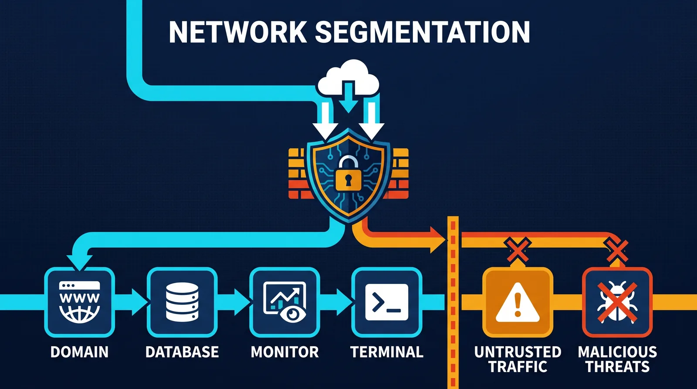
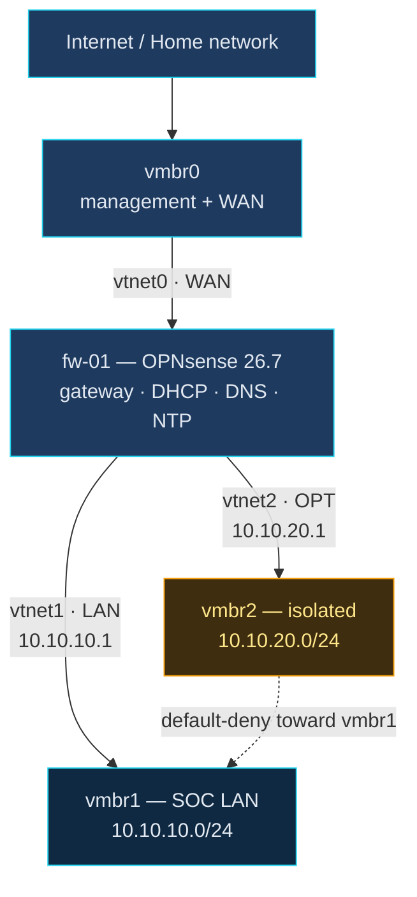

# Network Design



This document explains the planned network design for the MutaSpace SOC Lab.

The network design matters because a SOC lab is not just a group of virtual machines. The systems need to communicate in controlled ways so traffic can be routed, monitored, logged, and investigated.

This lab uses Proxmox bridges to separate different types of traffic.

---

## Network Design Purpose

The purpose of the network design is to create a clear and controlled virtual environment for cybersecurity learning.

The network should support:

- Proxmox host management
- Firewall and routing
- Internal lab systems
- SIEM communication
- Endpoint telemetry
- Network monitoring
- Controlled attack simulation
- Future segmentation and expansion

The goal is to avoid placing every VM on the same flat network.

A flat network is easier to set up, but it does not teach realistic infrastructure or SOC concepts well.

---

## Key Concepts

| Concept | Meaning |
|---|---|
| Proxmox Bridge | A virtual switch that connects VMs to a network |
| Management Network | The network used to access the Proxmox web interface |
| WAN | The outside-facing side of the firewall/router VM |
| LAN | The internal lab network behind the firewall/router VM |
| Virtual NIC | A virtual network card assigned to a VM |
| Gateway | The system that routes traffic out of a network |
| DNS | The service that translates names into IP addresses |

---

## Planned Bridges

The first version of the lab will use three Proxmox bridges.

| Bridge | Role | Purpose |
|---|---|---|
| `vmbr0` | Management / WAN | Proxmox management access and firewall WAN side |
| `vmbr1` | Internal SOC LAN | Main lab network for domain, endpoints, Wazuh, and analyst systems |
| `vmbr2` | Isolated / Untrusted | Controlled attack simulation and trust-boundary testing |

---

## Bridge Roles Explained

### `vmbr0`: Management and WAN

`vmbr0` is connected to the physical network interface.

This bridge allows the Proxmox host to be accessed from another device on the same network.

It will also provide the WAN-side connection for the firewall/router VM.

In simple terms:

```text
vmbr0 = outside access and Proxmox management
```

This network should be treated carefully because it provides access to the Proxmox host.

---

### `vmbr1`: Internal SOC LAN

`vmbr1` will be the main internal lab network.

This is where the core SOC systems will live.

Planned systems on this network include:

- Wazuh SIEM
- Windows endpoint
- Linux endpoint
- Ubuntu analyst workstation
- Active Directory domain controller
- Internal DNS services
- Suricata sensor placement, depending on final design

In simple terms:

```text
vmbr1 = internal lab network
```

This network represents the environment being monitored and defended.

---

### `vmbr2`: Isolated / Untrusted Network

`vmbr2` will be used for systems that should not sit directly on the main internal lab network.

This may include:

- Kali Linux
- Untrusted test systems
- Controlled attack simulation
- Trust-boundary experiments

In simple terms:

```text
vmbr2 = isolated or higher-risk lab network
```

This network helps teach segmentation and controlled security testing.

---

## Planned Firewall Placement

The firewall/router VM will connect to multiple bridges.

Planned firewall interfaces:

| Firewall Interface | Proxmox Bridge | Role |
|---|---|---|
| WAN | `vmbr0` | Outside or upstream network |
| LAN | `vmbr1` | Internal SOC lab network |
| Optional OPT/DMZ | `vmbr2` | Isolated or untrusted network |

The firewall/router VM will control traffic between the networks.

This design helps teach:

- WAN versus LAN separation
- Firewall rules
- Gateway configuration
- DHCP services
- DNS forwarding
- Network isolation
- Traffic control

---

## Planned Network Flow

The general traffic flow will look like this:



This means the firewall/router VM becomes the gatekeeper for lab traffic.

The NIC order above is the wire: Proxmox maps the first NIC to `net0`, which OPNsense
sees as `vtnet0` and assigns to WAN. Swapping two entries in `lab.yaml` boots the
firewall with WAN and LAN reversed, and nothing in a `tofu plan` hints at why.

A fourth bridge, `vmbr9`, exists but carries no lab traffic — it is the build plane
Packer uses before `fw-01` is routing. See [build-plane.md](build-plane.md).

---

## Why This Architecture Is Better Than One Flat Network

A flat network would place every VM on the same bridge.

That would be simpler, but it would not teach important SOC and infrastructure concepts.

This design is better because it supports:

- Segmentation
- Firewall rule testing
- Controlled attack simulation
- Better traffic visibility
- Cleaner troubleshooting
- More realistic enterprise design
- Safer separation between trusted and untrusted systems

A SOC analyst needs to understand not only alerts, but also the network environment that created those alerts.

---

## Virtual NIC Planning

Each VM connects to the lab through one or more virtual NICs.

A virtual NIC works like a network card inside a VM.

Example:

| VM | Virtual NIC Placement |
|---|---|
| `fw-01` | `vmbr0`, `vmbr1`, optional `vmbr2` |
| `wazuh-01` | `vmbr1` |
| `dc-01` | `vmbr1` |
| `win-client-01` | `vmbr1` |
| `ubuntu-app-01` | `vmbr1` |
| `ubuntu-analyst-01` | `vmbr1` |
| `kali-01` | `vmbr2` |
| `untrusted-01` | `vmbr2` |
| `sensor-01` | Placement depends on monitoring design |

---

## DNS Design Considerations

DNS will be important in this lab.

Active Directory depends heavily on DNS. Wazuh agents may also rely on name resolution depending on how they are configured.

DNS problems can cause:

- Domain join failures
- Agent enrollment failures
- Hostname resolution failures
- Authentication issues
- Confusing logs
- Broken internal service communication

The lab will document DNS carefully because DNS troubleshooting is a core infrastructure and SOC skill.

---

## Common Beginner Mistakes

### Mistake: Putting every VM on the management network

This makes the lab easier at first, but it weakens segmentation and can expose the Proxmox host to unnecessary risk.

### Mistake: Not knowing which VM is the gateway

Each network needs a gateway if systems must communicate outside that network.

In this design, the firewall/router VM should become the gateway for internal lab networks.

### Mistake: Confusing bridges with subnets

A bridge is like a virtual switch.

A subnet is an IP address range.

They work together, but they are not the same thing.

### Mistake: Building VMs before designing the network

If the network design is unclear, VM configuration becomes harder and troubleshooting becomes more confusing.

---

## Troubleshooting Mindset

When network problems happen, start with simple questions:

1. Is the VM connected to the correct bridge?
2. Does the VM have an IP address?
3. Is the IP address in the correct subnet?
4. Does the VM have the correct gateway?
5. Can it ping the gateway?
6. Can it ping another system on the same network?
7. Can it resolve DNS names?
8. Can it reach systems outside its network?
9. Is the firewall blocking traffic?
10. Are logs showing dropped or rejected traffic?

This approach teaches how to think through network problems instead of only copying commands.

---

## Validation Goals

The network design is working when:

- Proxmox management remains reachable
- Firewall/router VM connects to the correct bridges
- Internal lab VMs receive or use correct IP addresses
- Internal lab VMs use the firewall/router as their gateway
- DNS works for internal systems
- Traffic between networks is controlled by firewall rules
- Monitoring tools can observe the traffic they are supposed to see

---

## Learning Reflection

Network design is one of the most important parts of a SOC lab.

The tools matter, but the network determines what those tools can see.

A good SOC lab should teach how traffic moves, where logs come from, how systems communicate, and how segmentation affects security monitoring.

Before building VMs, the network must make sense.
