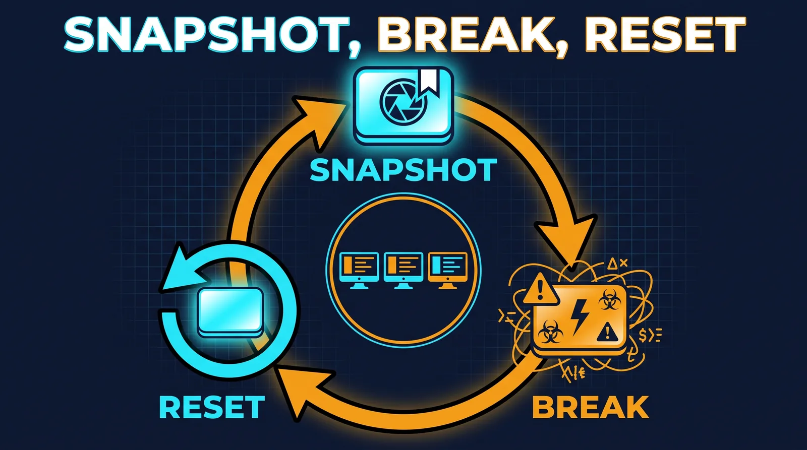
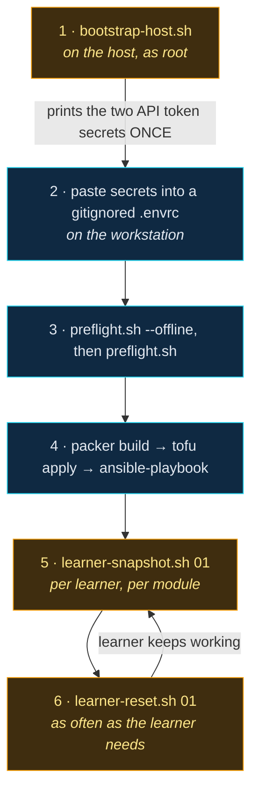

# Operational Scripts



This folder holds the shell scripts that sit either side of the infrastructure
code: the ones that prepare a bare Proxmox host so the code can run, and the
ones that run a classroom once the lab exists.

Everything here is plain Bash. There is no framework, no dependency file and no
build step, because these scripts have to run in the two least convenient places
in the project: a freshly installed Proxmox host with nothing on it, and a
learner's laptop.

---

## The Four Scripts

| Script | Runs on | When | What it does |
|---|---|---|---|
| `bootstrap-host.sh` | Proxmox host, as root | Once, before any IaC | Detects the PVE version, configures apt, creates the two API users/roles/tokens, enables `snippets`, creates `vmbr1`/`vmbr2`/`vmbr9` |
| `preflight.sh` | Workstation | Before every `packer build` / `tofu apply` | Pass/fail checklist: tooling, credential **shapes**, API, bridges, templates, ISOs |
| `learner-snapshot.sh` | Proxmox host, as root | Once per learner, per module | Takes the `baseline` snapshot |
| `learner-reset.sh` | Proxmox host, as root | Whenever a learner needs a clean slate | Rolls back, starts, then repairs the clock and the Wazuh agent |

Every script supports `--help`, and every script that changes anything supports
`--dry-run`.

### The two classroom scripts run on the host, and `task` knows that

`qm` is a host-local tool. There is no API behind it, and both learner scripts
refuse to start if they cannot find it. So `task learner:snapshot` and
`task learner:reset` do not run them locally — they `scp` the script to the node
and run it there with `ssh -t`:

```bash
export LAB_HOST_SSH="root@<LAB_MANAGEMENT_IP>"
task learner:snapshot LEARNER=01
task learner:reset    LEARNER=01
```

`LAB_HOST_SSH` is a *different* account from `PROXMOX_VE_SSH_USERNAME`. That one
is the `terraform` PAM user whose sudoers entry is deliberately narrowed to
`pvesm`, `qm` and a single `tee` target; it is not meant to be a general login.

`ssh -t` allocates a terminal on purpose. `learner-reset.sh` asks the operator to
type the learner id before it throws away their work, and that prompt has to
reach a real tty — piping the script over stdin would silently eat the answer.

### A learner's id is not necessarily their roster position

Both scripts derive VMIDs as `200 + (roster_index * 10) + role_offset`, where
`roster_index` is the learner's **position in `lab.yaml`**, not their id. Running
on the Proxmox host, the scripts cannot read `lab.yaml`, so they assume
`index = id - 1`. That is correct for the contiguous roster `01, 02, 03` this lab
ships with, and wrong the moment an id is skipped or a learner is removed.

Two guards:

- `--index <n>` passes the roster position explicitly.
- Every VM is verified **by name** before it is touched. The VM at the computed
  VMID must be called `<role>-l<id>`, which is the name OpenTofu gives it. A
  mismatch is a hard error, so the worst outcome is a refusal to act rather than
  a rollback of somebody else's work.

---

## Order of Operations



Amber steps run **on the Proxmox host**; cyan steps run on the workstation.

Steps 5 and 6 run on the host. `task learner:snapshot LEARNER=01` and
`task learner:reset LEARNER=01` do the copy-and-ssh for you.

---

## The One Thing That Wastes The Most Time

Packer and the `bpg/proxmox` OpenTofu provider both authenticate with a Proxmox
API token, and they want **the same secret in two different shapes**.

| Tool | Variable | Shape |
|---|---|---|
| Packer | `PKR_VAR_proxmox_username` | `packer@pve!buildtoken` |
| Packer | `PKR_VAR_proxmox_token` | `<uuid>` |
| Packer | `PKR_VAR_proxmox_url` | `https://<host>:8006/api2/json` — **with** the path |
| OpenTofu | `PROXMOX_VE_API_TOKEN` | `terraform@pve!provider=<uuid>` — **one string** |
| OpenTofu | `PROXMOX_VE_ENDPOINT` | `https://<host>:8006` — **without** the path |

Feeding one tool the other's shape produces a `401` whose message says nothing
about shape. `bootstrap-host.sh` prints both forms verbatim at creation time,
and `preflight.sh` regexes both forms before you burn forty minutes on a Windows
template build. That check is the reason `preflight.sh` exists.

A second, quieter version of the same trap: a token created without
`--privsep=0` inherits **no** privileges at all, so a perfectly shaped token
still returns `403` on every call.

---

## Design Decisions Worth Knowing

**Each script is self-contained.** There is no shared `lib/`. That costs some
duplicated helper functions, and it buys the ability to `scp bootstrap-host.sh
root@host:` and run it — which is exactly how a host bootstrap gets used. It
also means each script reads top to bottom as a single teaching artifact.

**Idempotency is loud, not silent.** Re-running `bootstrap-host.sh` prints
`[ == ] <thing> already correct` rather than saying nothing. A script that
silently does nothing is indistinguishable from a script that silently failed.

**Refusals are hard.** `bootstrap-host.sh` refuses to run on PVE 7.x (the bpg
provider does not support it) and refuses to rewrite `/etc/network/interfaces`
if a guest is already attached to a bridge it would create. Both refusals exist
because the failure they prevent is much more expensive than the inconvenience
they cause.

**The learner scripts do the repair work.** A snapshot rollback is a time
machine, and this lab has two subsystems that care intensely about time and
identity: Kerberos (five-minute default clock skew tolerance) and the Wazuh
manager (one-hour default re-registration block for a same-named agent). Leaving
those for the learner to discover means the learner spends the lab debugging the
lab, so `learner-reset.sh` forces a clock resync and restarts the agent itself.

**`preflight.sh` requires `jq`.** Every host check parses the PVE API's JSON.
Hand-rolled JSON parsing in Bash is how you get a check that passes when it
should fail, which is worse than no check at all.

**The management subnet never appears.** `vmbr0` and the host's real management
address are secrets under this repository's policy. `bootstrap-host.sh` runs on
the host and could easily print them; it deliberately prints
`<LAB_MANAGEMENT_IP>` instead. Only `10.10.10.0/24`, `10.10.20.0/24` and
`10.99.0.0/24` appear in this folder, and all three are already public in the
documentation.

---

## The `10.10.10.1` Trap

Proxmox's own documentation for a masqueraded internal bridge uses
`10.10.10.1/24` as the bridge address. In this lab, `10.10.10.1` is **fw-01's
LAN address** and the default gateway for every VM on the SOC LAN.

Copying that example verbatim puts the Proxmox host on the firewall's gateway
address, which produces a lab where two devices answer for the same gateway and
nothing behaves consistently. The build plane is `10.99.0.0/24` specifically so
that collision cannot happen, and `bootstrap-host.sh` prints a warning banner
about it every time it touches the network configuration.

---

## Verification Status

These scripts were authored **offline**, before the Proxmox host existed
(decision D-05). What that means honestly:

**Verified**

- `bash -n` parses cleanly on all four scripts.
- `shellcheck 0.10.0` reports **zero findings** at default severity on all four.
- `--help` renders and exits `0` on all four.
- Learner-id validation and the VMID arithmetic were exercised directly. Learner
  `01` resolves to `205`/`206` and learner `50` to `695`/`696`, as the policy
  requires; `0`, `51`, `abc`, `123`, `1a`, `-1` and the empty string are all
  rejected.
- `bootstrap-host.sh` was run end to end against a **stub Proxmox host** —
  fake `pveversion`, `pveum`, `pvesh`, `pvesm`, `ifreload`, `ip` and `iptables`,
  plus a fake `/etc/network/interfaces` and `/etc/pve/storage.cfg`. That
  exercised: the PVE 9 path, the PVE 8 path (one-line apt sources, `VM.Monitor`
  present, `SDN.Use`/`VM.GuestAgent.Audit` absent), the PVE 7 refusal, the
  refusal to touch the network when a guest is already on `vmbr1`, `--dry-run`
  leaving the interfaces file byte-identical, `--rotate-tokens`, and a
  fully-converged re-run reporting **`changed: 0, skipped: 13`**.
- `preflight.sh` was run against a **mock PVE API** (a local HTTP server serving
  `/version`, `/storage/local`, `/nodes/*/network`, `/nodes/*/qemu` and the ISO
  content listing). It correctly detected a deliberately non-template VMID and a
  deliberately missing ISO, exited `1` on those, and exited `0` once the mock was
  corrected. The 401 path and the `--offline` path were exercised too.
- The credential-shape regexes were tested against correct values, against
  deliberately **swapped** values (the bpg string in the Packer variable and vice
  versa), and against a shared secret.
- The `yaml_*` readers were tested against the repository's real `lab.yaml` and
  extract `site.node`, the storage names and all six template VMIDs correctly.

**Not verified, and cannot be until the host exists**

- The real `pveum`, `pvesm`, `qm` and `ifreload` binaries. Every test above used
  stubs that return what the documentation says these tools return. If a real
  PVE release returns a different shape, the stub tests will not have caught it.
- The exact JSON returned by `pvesh get /access/roles/<id>`, `/access/users/...`
  and `/access/acl`. Presence tests use exit status (robust); the privilege
  comparison parses a key list (less robust).
- The minimum privilege sets. They are a **synthesis**, not an authoritative
  published list — no such list exists for Packer plus OpenTofu on PVE 8/9. PVE
  returns a precise `403 Permission check failed (<path>, <Priv>)`, so the
  correct method is to start narrow and add what the 403 names.
- Whether `qm guest exec` accepts the exact argv this repo passes it. The argv
  vectors were verified against a stub (the quoted PowerShell command and the
  `/bin/sh -c` strings each survive as one argument), but no guest agent has
  actually executed them.
- The `DEFAULT_ISO_SHELF` list in `preflight.sh`. It is aligned with the
  `default` values in `packer/win-server-2022`, `packer/win11-client` and
  `packer/opnsense-267` as they stand today, but nothing enforces that. Once
  `lab.yaml` grows an `iso_shelf:` block, that becomes the single source and this
  fallback stops mattering.

Nothing in this folder has been run against a real Proxmox host. Treat the first
run as part of the build, not as a formality.

---

## Learning Reflection

The most interesting thing about writing these scripts was noticing how much of
the work was *refusing to do things*.

`bootstrap-host.sh` is a little over a thousand lines, and a meaningful fraction of
it exists to stop the script running: it refuses PVE 7.x, refuses to rewrite the
network configuration when a guest is already attached to a bridge it would
create, refuses to print a token secret it cannot actually produce, and refuses
to `apt full-upgrade` the host even though that is the obvious next command. Each
of those refusals started as a "what if" and turned into a guard.

That is a pattern worth naming, because the instinct when writing automation is
the opposite: make it do more, handle more cases, keep going. But a bootstrap
script runs once, on a machine that is about to hold a classroom, usually by
someone who is tired. The expensive failure is not "the script stopped and told
me why". The expensive failure is "the script kept going and now the network
configuration is wrong and six VMs are unreachable".

The second lesson is that a script's output is part of its interface. The
credential printout in `bootstrap-host.sh` is longer than the code that creates
the tokens, because the code is trivial and the *shape* of what it produces is
the thing people get wrong. Printing both export blocks side by side, with the
`/api2/json` asymmetry spelled out, costs thirty lines and saves an afternoon.

The third is that idempotency is not a property you add at the end. It changed
the structure of every function: each one asks "is this already true?" before it
asks "how do I make this true?". The one place it could not be achieved — a PVE
API token secret, which is displayed exactly once and never again — is
documented as a limitation with an escape hatch (`--rotate-tokens`) rather than
quietly papered over. A tool that pretends to be idempotent when it is not is
worse than one that admits the seam.
